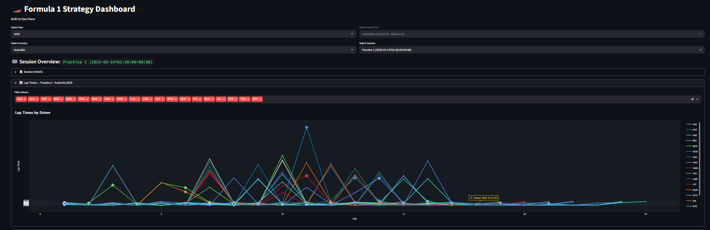
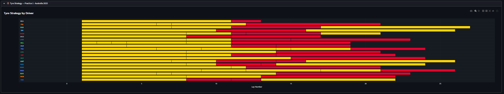
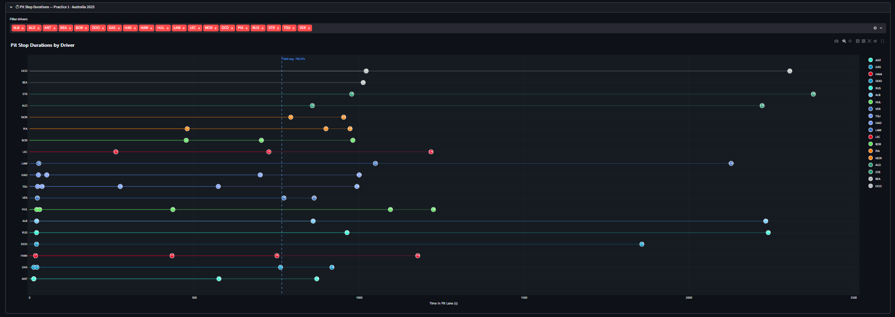

# F1 Strategy Dashboard

An interactive Formula 1 strategy dashboard built with Streamlit and Plotly, powered by the [OpenF1 API](https://openf1.org).

## Features

- Select any race session by year, country, and session type (FP1, Qualifying, Race, etc.)
- Lap time chart with per-driver color coding
- Tire strategy visualization across all stints
- Pit stop duration comparison
- Tyre degradation trends per compound with linear regression trendlines
- Sector time analytics across all three sectors, per driver per lap

## Screenshots





## Project Structure

```
OpenF1_project/
├── app/
│   ├── data_loader.py       # OpenF1 API requests with Streamlit caching
│   ├── data_processor.py    # Data cleaning, enrichment, and tyre/sector processing
│   └── visualizer.py        # Plotly chart builders
├── main.py                  # Streamlit app entry point
├── requirements.txt
└── .env                     # BASE_API_URL configuration
```

## Setup

**1. Create and activate a virtual environment**
```bash
python -m venv venv
source venv/bin/activate        # Windows: venv\Scripts\activate
```

**2. Install dependencies**
```bash
pip install -r requirements.txt
```

**3. Configure environment**

Create a `.env` file in the project root:
```
BASE_API_URL=https://api.openf1.org/v1/
```

## Running the App

```bash
streamlit run main.py
```

The dashboard will open in your default browser.

## Data Sources

All telemetry data is fetched live from the [OpenF1 API](https://openf1.org):

| Endpoint   | Usage                                                      |
|------------|------------------------------------------------------------|
| `meetings` | List of races for a given season                           |
| `sessions` | FP1, Qualifying, Race sessions per meeting                 |
| `laps`     | Per-driver lap times, sector times, and pit-out flags      |
| `stints`   | Tire compound and stint ranges                             |
| `pit`      | Pit stop events and durations                              |
| `drivers`  | Driver numbers, abbreviations, team colors                 |

## Dependencies

- `streamlit` — web UI
- `pandas` — data handling
- `plotly` — interactive charts
- `requests` — HTTP calls to OpenF1 API
- `python-dotenv` — environment variable loading
